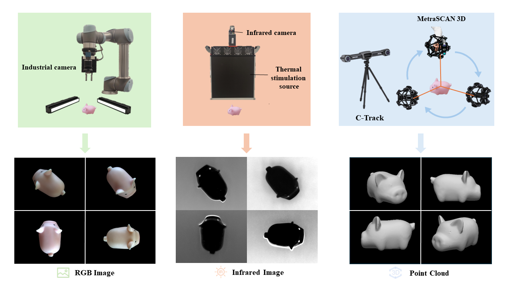
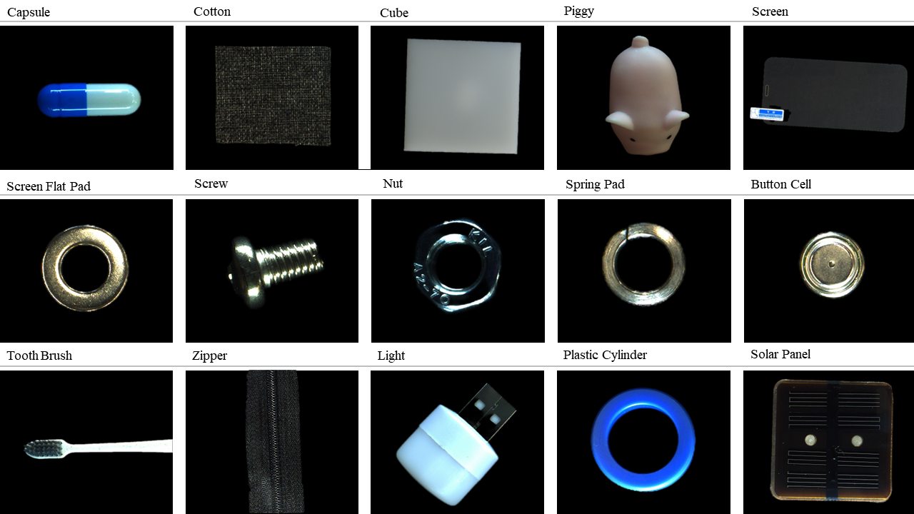
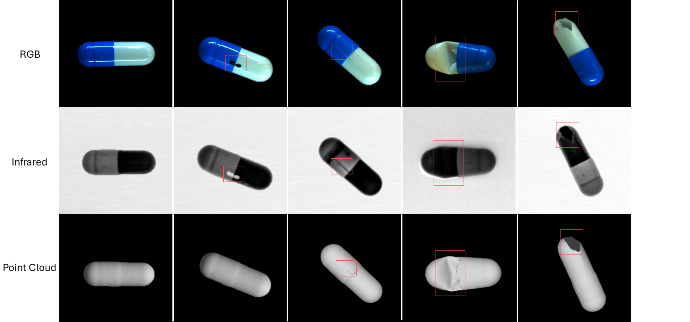
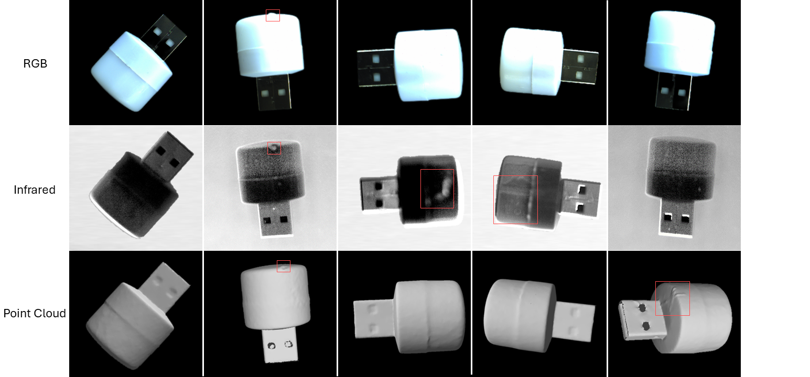

# Multi-Sensor Object Anomaly Detection: Unifying Appearance, Geometry, and Internal Properties
## [[Project Page](https://zzzbbbzzz.github.io/MulSen_AD/index.html)]  ## [[Arxiv](https://zzzbbbzzz.github.io/MulSen_AD/index.html)]

## [[Arxiv](https://zzzbbbzzz.github.io/MulSen_AD/index.html)]
## 1.Abstract
>Object anomaly detection is essential for industrial quality inspection, yet traditional single-sensor methods face critical limitations. They fail to capture the wide range of anomaly types, as single sensors are often constrained to either external appearance, geometric structure, or internal properties. To overcome these challenges, we introduce **MulSen-AD**, the first high-resolution, multi-sensor anomaly detection dataset tailored for industrial applications. MulSen-AD unifies data from RGB cameras, laser scanners, and lock-in infrared thermography, effectively capturing external appearance, geometric deformations, and internal defects. The dataset spans 15 industrial products with diverse, real-world anomalies. We also present MulSen-AD Bench, a benchmark designed to evaluate multi-sensor methods, and propose MulSen-TripleAD, a decision-level fusion algorithm that integrates these three modalities for robust, unsupervised object anomaly detection. Our experiments demonstrate that multi-sensor fusion substantially outperforms single-sensor approaches, achieving 96.1\% AUROC in object-level detection accuracy. These results highlight the importance of integrating multi-sensor data for comprehensive industrial anomaly detection. 


## 1.Introduction
> In this project, we propose the first Multi-Sensor Anomaly Detection (Mulsen-AD) dataset and develop a comprehensive benchmark (Mulsen-AD Bench) on Mulsen-AD dataset. Specifically,  we build Mulsen-AD dataset with high-resolution industrial camera, high-precision laser scanner and lock-in infrared thermography. To exactly replicate real industrial scenarios, Mulsen-AD dataset is comprised of 15 types of distinct and authentic industrial products, featuring a variety of defects that require detection through the integration of multiple sensors. Additionally, we propose Mulsen-TripleAD algorithm, a decision level gating method, to solve the problem of object anomaly detection with the combination of three sensors.


- (a) is Existing single-sensor object-level anomaly detection.
- (b) is our introduced multi-sensor object-level anomaly detection setting.

The main contributions are summarized as follows:
-  We introduced Multi-Sensor Anomaly Detection (**Mulsen-AD**) setting, a practical and challenging setting for object level anomaly detection based on three different industrial sensors, solving the limitations of single sensor anomaly detection, and bridged the gap between industrial and research in object anomaly detection.
-  We developed **Mulsen-AD** dataset, the first real dataset for evaluating multi-sensor anomaly detection, featuring diverse, high-quality object data captured by high-resolution devices and anomalies based on actual factory conditions.
-  We conducted a comprehensive benchmark using the Mulsen-AD dataset and provided a universal toolkit to facilitate further exploration and reproduction of the benchmark.
-  We proposed **Mulsen-TripleAD**, a decision fusion gating method for multi-sensor anomaly detection. Utilizing data from three types of sensors and combining multiple memory banks with a decision gating unit, *Mulsen-TripleAD* outperforms setups using fewer sensors and sets a new baseline for our multi-sensor anomaly detection task.


## 2. Mulsen AD dataset

### 2.1 Collection pipeline
MulSen-AD includes **RGB images** acquired by cameras, **infrared images**(gray-scale images) by lock-in infrared thermography and **high-resolution 3D point clouds** by laser scanners.



### 2.2 Meet our 15 categories
We selected 15 objects made by different materials, including metal, plastic, fiber, rubber, semiconductor and composite materials, with different shapes, sizes and colors.



### 2.3 Anomaly types and samples
we manually created 14 types of anomalies, including cracks, holes, squeeze, external and internal broken, creases, scratches, foreign bodies, label, bent, color, open, substandard, and internal detachments. The anomalies are designed to closely resemble real industrial situations, with a wide distribution of types, including surface, internal, and 3D geometric anomalies. 

Capsule：



Light：



Cotton：


*More samples can be found on the [website](https://zzzbbbzzz.github.io/MulSen_AD/index.html).

### 2.4 Data Directory
- Download [MulSen_AD.rar] and extract into `./dataset/MulSen_AD`
```
MulSen_AD
├── capsule                              ---Object class folder.
    ├── RGB                              ---RGB images
        ├── train                        ---A training set of RGB images
            ├── 0.png
            ...
        ├── test                         ---A test set of RGB images
            ├── hole                     ---Types of anomalies, such as hole. 
                ├── 0.png
                ...
            ├── crack                    ---Types of anomalies, such as crack.
                ├── 0.png
                ...
            ├── good                     ---RGB images without anomalies.
                ├── 0.png
                ...
            ...
        ├── GT                           ---GT segmentation mask for various kinds of anomalies.
            ├── hole
                ├── 0.png
                ├── data.csv             ---Label information
                ...
            ├── crack
                ├── 0.png
                ├── data.csv
                ...
            ├── good
                ├── data.csv
            ...
        ...
    ├── Infrared                        ---Infrared images
        ├── train
        ├── test
        ├── GT
    ├── Pointcloud                      ---Point Clouds
        ├── train
        ├── test
        ├── GT
├── cotton                             ---Object class folder.                      
    ... 
...
```


## 3. Download

### 3.1 Dataset


The dataset can be quickly reviewed on the [website](https://zzzbbbzzz.github.io/MulSen_AD/index.html).

After download, put the dataset in `dataset` folder.

### 3.2 Checkpoint

To download the pre-trained PointMAE model using [this link](https://drive.google.com/file/d/1-wlRIz0GM8o6BuPTJz4kTt6c_z1Gh6LX/view?usp=sharing). 

After download, put the checkpoint file in `checkpoints` folder.


## 4. Getting Started in the MulSen-AD Setup


### 4.1 Installation
To start, I recommend to create an environment using conda:
```
conda create -n MulSen_AD python=3.8
conda activate MulSen_AD
```

Clone the repository and install dependencies:
```
$ git clone https://github.com/ZZZBBBZZZ/MulSen-AD.git
$ cd MulSen-AD
$ pip install -r requirements.txt
```  


### 4.2 Train and Test
Firstly, please ensure that the dataset and checkpoints have been downloaded and placed in the corresponding folders. The file format is like this:
```
checkpoints
 └ pointmae_pretrain.pth
dataset
 └ MulSen_AD
    └...
```


Train and test with the following command:
```
$ sh start.sh
```

## 5 To use our dataset for Single 3D Anomaly Detection
Our Mulsen-AD dataset contains a high quality 3D dataset, solving the problem of small training set and small distribution of the previous dataset（Real3d and Anomaly Shapenet). We also encourage to just use our dataset for 3D anomaly detection.

In the MulSen-AD setting, an object is labeled as abnormal if any one of the three modalities (RGB images, infrared images, or point clouds) is labeled as abnormal. However, in the 3D AD setting, an object is labeled as abnormal only if the point cloud specifically is labeled as abnormal. (You could refer to the csv label file in our dataset). 

For convenience, you can directly download our dataset and the following class code for 3D anomaly detection.The benchmark is listed in sec3.2(SingeBench-3D for MulSen-AD dataset) above.

### 5.1 Dataset Class for Training
```
class DatasetMulSen_3dad_train(Dataset):
    def __init__(self, dataset_dir, cls_name, num_points, if_norm=True, if_cut=False):
        self.num_points = num_points
        self.dataset_dir = dataset_dir
        self.train_sample_list = glob.glob(os.path.join(self.dataset_dir,cls_name, 'Pointcloud', 'train') + "/*.stl")
        self.if_norm = if_norm

    def norm_pcd(self, point_cloud):
        center = np.average(point_cloud,axis=0)
        new_points = point_cloud-np.expand_dims(center,axis=0)
        return new_points

    def __getitem__(self, idx):
        mesh_stl = o3d.geometry.TriangleMesh()
        mesh_stl = o3d.io.read_triangle_mesh(self.train_sample_list[idx])
        mesh_stl = mesh_stl.remove_duplicated_vertices()
        pc = np.asarray(mesh_stl.vertices)
        N = pc.shape[0]
        pointcloud = self.norm_pcd(pc)
        mask = np.zeros((pointcloud.shape[0]))
        label = 0
        return (1,pointcloud,1), mask, label, self.train_sample_list[idx]

    def __len__(self):
       return len(self.train_sample_list)
```
### 5.1 Dataset Class for Testing
```
class DatasetMulSen_3dad_test(Dataset):
    def __init__(self, dataset_dir, cls_name, num_points, if_norm=True, if_cut=False):
        self.num_points = num_points
        self.dataset_dir = dataset_dir
        self.if_norm = if_norm
        self.cls_name = cls_name
   
        self.test_sample_list, self.labels = self.load_dataset() 

        self.gt_path = str(os.path.join(dataset_dir, self.cls_name, 'Pointcloud','GT'))
        print("the number of test dataset is ",len(self.test_sample_list))
    
    def sort(self, file_paths):
        
        paths_with_numbers = []
        pattern = re.compile(r'(\d+)\.(png|stl)$')
        for path in file_paths:
            match = pattern.search(path)
            if match:
                number = int(match.group(1))
                paths_with_numbers.append((path, number))
        paths_with_numbers.sort(key=lambda x: x[1])    
        sorted_paths = [p[0] for p in paths_with_numbers]
        return sorted_paths
     
    def load_dataset(self):
        test_sample_list = []
        labels_list = []
        defect_types = os.listdir(os.path.join(self.dataset_dir,self.cls_name, 'Pointcloud', 'test'))
        for defect_type in defect_types:
            if defect_type == "good":
                test_good_sample_list = glob.glob(os.path.join(self.dataset_dir,self.cls_name, 'Pointcloud', 'test', defect_type) + "/*.stl")
                test_good_sample_list = self.sort(test_good_sample_list)
                labels_list.extend([0] * len(test_good_sample_list))
                test_sample_list.extend(test_good_sample_list)
            else:
                with open(os.path.join(self.dataset_dir,self.cls_name,'RGB','GT',defect_type,'data.csv'),'r') as file:
                    csvreader = csv.reader(file)
                    header = next(csvreader)
                    for row in csvreader:
                        object, label1, label2, label3 = row

                        labels_list.extend([int(label3)])
                test_nogood_sample_list = glob.glob(os.path.join(self.dataset_dir,self.cls_name, 'Pointcloud', 'test', defect_type) + "/*.stl")
                test_nogood_sample_list= self.sort(test_nogood_sample_list)
                test_sample_list.extend(test_nogood_sample_list)

        return test_sample_list, labels_list
            
    def norm_pcd(self, point_cloud):

        center = np.average(point_cloud,axis=0)
 
        new_points = point_cloud-np.expand_dims(center,axis=0)
        return new_points
    

    def create_mask(self,pointcloud, pc):
        mask = []
        for point in pc:
            if point in pointcloud:
                mask.append(1)
            else:
                mask.append(0)
        return np.array(mask)

    def __getitem__(self, idx):
        sample_path = self.test_sample_list[idx]
        if ('good' in sample_path ) or (self.labels[idx] == 0):
            mesh_stl = o3d.geometry.TriangleMesh()
            mesh_stl = o3d.io.read_triangle_mesh(sample_path)
   
            mesh_stl = mesh_stl.remove_duplicated_vertices()
            pc = np.asarray(mesh_stl.vertices)
            N = pc.shape[0]
            pointcloud = self.norm_pcd(pc)
   
            mask = np.zeros((pointcloud.shape[0]))
            label = 0
        else:
            mesh_stl = o3d.geometry.TriangleMesh()
            mesh_stl = o3d.io.read_triangle_mesh(sample_path)
            mesh_stl = mesh_stl.remove_duplicated_vertices()
            pointcloud = np.asarray(mesh_stl.vertices)
            filename = pathlib.Path(sample_path).stem
            anomaly_type = pathlib.Path(sample_path).parent.stem
            txt_path = os.path.join(self.gt_path,anomaly_type,filename + '.txt')
            pcd = np.genfromtxt(txt_path, delimiter=",")
            pointcloud_mask = pcd[:, :3]
            mask = self.create_mask(pointcloud_mask,pointcloud)
            label = 1
        if(self.if_norm):
            pointcloud = self.norm_pcd(pointcloud)
        return (1,pointcloud,1), mask, label, sample_path

    def __len__(self):
        return len(self.test_sample_list)
```
## Thanks

Our code is built on [Real3D-AD](https://github.com/eliahuhorwitz/3D-ADS) and [M3DM](https://github.com/nomewang/M3DM), thanks for their excellent works!

## License
The dataset is released under the CC BY 4.0 license.
