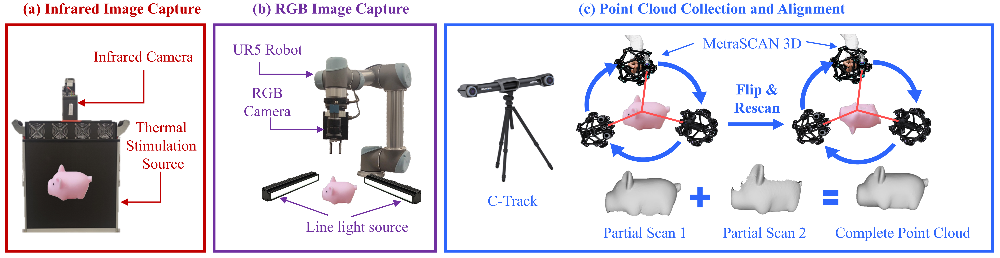
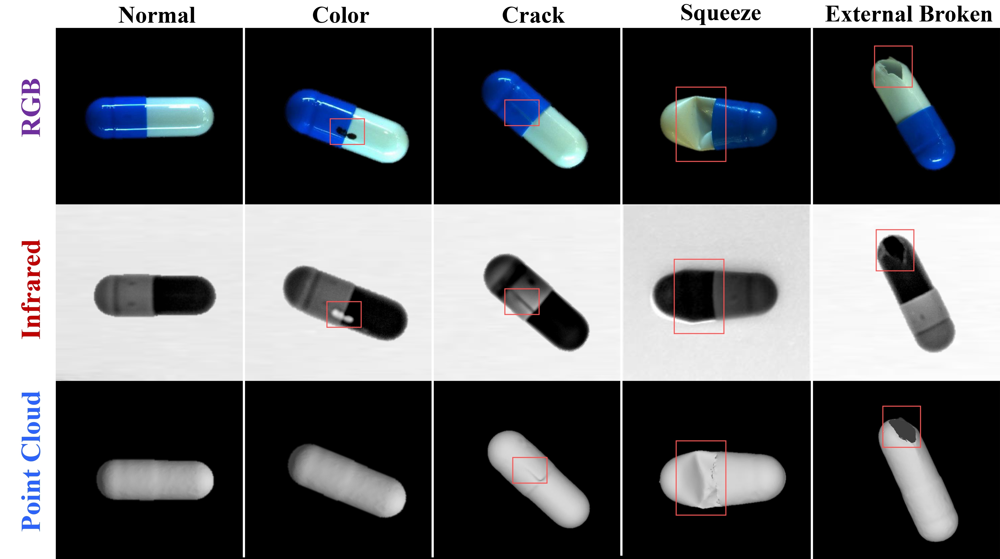
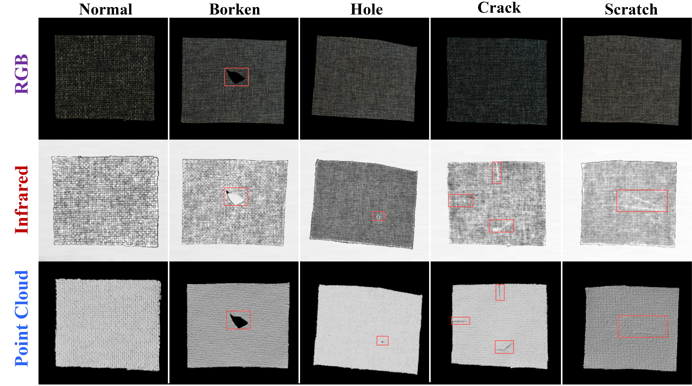
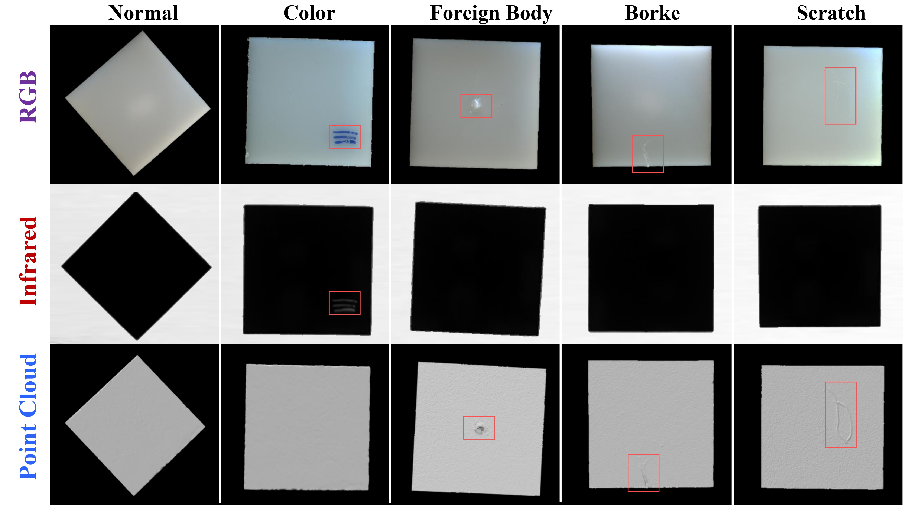
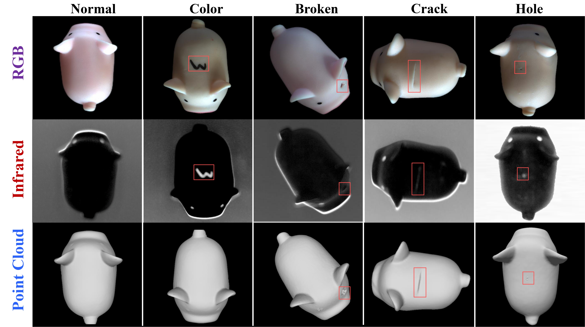

# Multi-Sensor Object Anomaly Detection: Unifying Appearance, Geometry, and Internal Properties
## [[Project Page](https://zzzbbbzzz.github.io/MulSen_AD/index.html)] [[Arxiv](https://zzzbbbzzz.github.io/MulSen_AD/index.html)] [[Dataset](https://huggingface.co/datasets/orgjy314159/MulSen_AD/tree/main)]

## Table of Contents
- [Abstract](#Abstract)
- [Mulsen-AD Dataset](#Mulsen AD dataset)
- [Download](#Download)
  - [Dataset](#Dataset)
  - [Checkpoint](#Checkpoint)
- [Getting Started in the MulSen-AD Setup](#Getting Started in the MulSen-AD Setup)
  - [Installation](#Installation)
  - [Train and Test](#Train and Test)
- [Mulsen AD Benchmark](#Mulsen AD Benchmark)
- [To use our dataset for Single 3D Anomaly Detection](#To use our dataset for Single 3D Anomaly Detection)
- [Single 3D Benchmark](#Single 3D Benchmark)
## 1.Abstract
>Object anomaly detection is essential for industrial quality inspection, yet traditional single-sensor methods face critical limitations. They fail to capture the wide range of anomaly types, as single sensors are often constrained to either external appearance, geometric structure, or internal properties. To overcome these challenges, we introduce **MulSen-AD**, the first high-resolution, multi-sensor anomaly detection dataset tailored for industrial applications. MulSen-AD unifies data from **RGB cameras, laser scanners, and lock-in infrared thermography**, effectively capturing external appearance, geometric deformations, and internal defects. The dataset spans 15 industrial products with diverse, real-world anomalies. We also present MulSen-AD Bench, a benchmark designed to evaluate multi-sensor methods, and propose MulSen-TripleAD, a decision-level fusion algorithm that integrates these three modalities for robust, unsupervised object anomaly detection. Our experiments demonstrate that multi-sensor fusion substantially outperforms single-sensor approaches, achieving 96.1\% AUROC in object-level detection accuracy. These results highlight the importance of integrating multi-sensor data for comprehensive industrial anomaly detection. 


## 2. Mulsen AD dataset

### 2.1 Collection pipeline
MulSen-AD includes **infrared images**(gray-scale images) by lock-in infrared thermography, **RGB images** acquired by cameras and **high-resolution 3D point clouds** by laser scanners. The following figure shows the data collection pipeline, the pink ’Piggy’ object serves as the example for data collection.



### 2.2 Meet our 15 categories
We selected 15 objects made by different materials, including metal, plastic, fiber, rubber, semiconductor and composite materials, with different shapes, sizes and colors.


### 2.3 Anomaly types and samples
we manually created 14 types of anomalies, including cracks, holes, squeeze, external and internal broken, creases, scratches, foreign bodies, label, bent, color, open, substandard, and internal detachments. The anomalies are designed to closely resemble real industrial situations, with a wide distribution of types, including **surface, internal, and 3D geometric anomalies**. 

<!-- Capsule： -->



<!-- Light： -->



<!-- Cotton： -->





*More samples can be found on the [website](https://zzzbbbzzz.github.io/MulSen_AD/index.html).

### 2.4 Data Directory

- **Note:** Object-level labels are stored in the `RGB/GT/[anomaly_type]/data.csv` file, where `[anomaly_type]` should be replaced with the actual exception type.
```
MulSen_AD
├── capsule                              ---Object class folder.
    ├── RGB                              ---RGB images
        ├── train                        ---A training set of RGB images
            ├── 0.png
            ...
        ├── test                         ---A test set of RGB images
            ├── hole                     ---Types of anomalies, such as hole. 
                ├── 0.png
                ...
            ├── crack                    ---Types of anomalies, such as crack.
                ├── 0.png
                ...
            ├── good                     ---RGB images without anomalies.
                ├── 0.png
                ...
            ...
        ├── GT                           ---GT segmentation mask for various kinds of anomalies.
            ├── hole
                ├── 0.png
                ├── data.csv             ---Label information
                ...
            ├── crack
                ├── 0.png
                ├── data.csv
                ...
            ├── good
                ├── data.csv
            ...
        ...
    ├── Infrared                        ---Infrared images
        ├── train
        ├── test
        ├── GT
    ├── Pointcloud                      ---Point Clouds
        ├── train
        ├── test
        ├── GT
├── cotton                             ---Object class folder.                      
    ... 
...
```


## 3. Download

### 3.1 Dataset


Download [MulSen_AD.rar](https://huggingface.co/datasets/orgjy314159/MulSen_AD/tree/main) and extract into `./dataset/MulSen_AD`

### 3.2 Checkpoint

To download the pre-trained PointMAE model using [this link](https://drive.google.com/file/d/1-wlRIz0GM8o6BuPTJz4kTt6c_z1Gh6LX/view?usp=sharing). 

After download, put the checkpoint file in `./checkpoints` folder.


## 4. Getting Started in the MulSen-AD Setup


### 4.1 Installation
To start, I recommend to create an environment using conda:
```
conda create -n MulSen_AD python=3.8
conda activate MulSen_AD
```

Clone the repository and install dependencies:
```
$ git clone https://github.com/ZZZBBBZZZ/MulSen-AD.git
$ cd MulSen-AD
$ pip install -r requirements.txt
```  


### 4.2 Train and Test
Firstly, please ensure that the dataset and checkpoints have been downloaded and placed in the corresponding folders. The file format is like this:
```
checkpoints
 └ pointmae_pretrain.pth
dataset
 └ MulSen_AD
    └...
```


Train and test with the following command:
```
$ sh start.sh
```
## 5 Mulsen-AD Benchmark
## 6 To use our dataset for Single 3D Anomaly Detection
- Our Mulsen-AD dataset contains a high quality 3D dataset. We also encourage to just use our dataset for 3D anomaly detection.

- **Note:** In the MulSen-AD setting, an object is labeled as abnormal if any one of the three modalities (RGB images, infrared images, or point clouds) is labeled as abnormal. However, in the single 3D AD setting, an object is labeled as abnormal only if the point cloud specifically is labeled as abnormal. (You could refer to the csv label file in our dataset). 

For convenience, you can directly download our dataset along with the following class code for 3D anomaly detection. The benchmark details are provided in Section 10 (Single 3D Benchmark) of the supplementary material above.

**Single 3D Train/Test Dataset Class: `./dataset_3D.py`**
## 7 Single 3D Benchmark

## Thanks

Our code is built on [PatchCore](https://github.com/amazon-science/patchcore-inspection), [Real3D-AD](https://github.com/eliahuhorwitz/3D-ADS) and [M3DM](https://github.com/nomewang/M3DM), thanks for their excellent works!

## License
The dataset is released under the CC BY 4.0 license.
