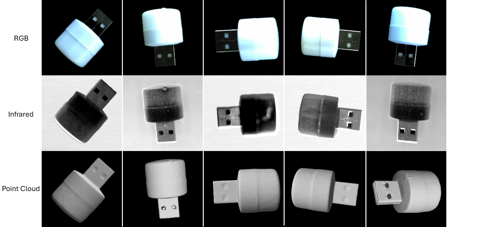
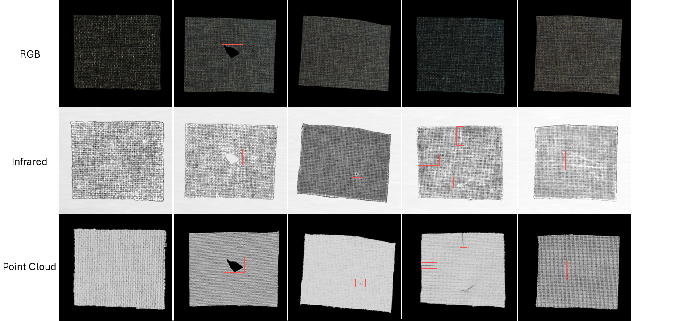

# MulSen-AD: A Dataset and Benchmark for Multi-Sensor Anomaly Detection
## [[Project Page](https://zzzbbbzzz.github.io/MulSen_AD/index.html)]


## 1.Introduction
> In this project, we propose the first Multi-Sensor Anomaly Detection (Mulsen-AD) dataset and develop a comprehensive benchmark (Mulsen-AD Bench) on Mulsen-AD dataset. Specifically,  we build Mulsen-AD dataset with high-resolution industrial camera, high-precision laser scanner and lock-in infrared thermography. To exactly replicate real industrial scenarios, Mulsen-AD dataset is comprised of 15 types of distinct and authentic industrial products, featuring a variety of defects that require detection through the integration of multiple sensors. Additionally, we propose Mulsen-TripleAD algorithm, a decision level gating method, to solve the problem of object anomaly detection with the combination of three sensors.


- (a) is Existing single-sensor object-level anomaly detection.
- (b) is our introduced multi-sensor object-level anomaly detection setting.

The main contributions are summarized as follows:
-  We introduced Multi-Sensor Anomaly Detection (**Mulsen-AD**) setting, a practical and challenging setting for object level anomaly detection based on three different industrial sensors, solving the limitations of single sensor anomaly detection, and bridged the gap between industrial and research in object anomaly detection.
-  We developed **Mulsen-AD** dataset, the first real dataset for evaluating multi-sensor anomaly detection, featuring diverse, high-quality object data captured by high-resolution devices and anomalies based on actual factory conditions.
-  We conducted a comprehensive benchmark using the Mulsen-AD dataset and provided a universal toolkit to facilitate further exploration and reproduction of the benchmark.
-  We proposed **Mulsen-TripleAD**, a decision fusion gating method for multi-sensor anomaly detection. Utilizing data from three types of sensors and combining multiple memory banks with a decision gating unit, *Mulsen-TripleAD* outperforms setups using fewer sensors and sets a new baseline for our multi-sensor anomaly detection task.


## 2.Mulsen AD dataset

### 2.1 Collection pipeline
MulSen-AD includes **RGB images** acquired by cameras, **infrared images**(gray-scale images) by lock-in infrared thermography and **high-resolution 3D point clouds** by laser scanners.


### 2.2 Meet our 15 categories
We selected 15 objects made by different materials, including metal, plastic, fiber, rubber, semiconductor and composite materials, with different shapes, sizes and colors.


### 2.3 Anomaly types and samples
we manually created 14 types of anomalies, including cracks, holes, squeeze, external and internal broken, creases, scratches, foreign bodies, label, bent, color, open, substandard, and internal detachments. The anomalies are designed to closely resemble real industrial situations, with a wide distribution of types, including surface, internal, and 3D geometric anomalies. 

Capsule：


Light：



Cotton：



*More samples can be found on the [website](https://zzzbbbzzz.github.io/MulSen_AD/index.html).

### 2.4 Data Directory
- Download MulSen_AD.rar and extract into `./dataset/MulSen_AD`
```
MulSen_AD
├── capsule                              ---Object class folder.
    ├── RGB                              ---RGB images
        ├── train                        ---A training set of RGB images
            ├── 0.png
            ...
        ├── test                         ---A test set of RGB images
            ├── hole                     ---Types of anomalies, such as hole. 
                ├── 0.png
                ...
            ├── crack                    ---Types of anomalies, such as crack.
                ├── 0.png
                ...
            ├── good                     ---RGB images without anomalies.
                ├── 0.png
                ...
            ...
        ├── GT                           ---GT segmentation mask for various kinds of anomalies.
            ├── hole
                ├── 0.png
                ├── data.csv             ---Label information
                ...
            ├── crack
                ├── 0.png
                ├── data.csv
                ...
            ├── good
                ├── data.csv
            ...
        ...
    ├── Infrared                        ---Infrared images
        ├── train
        ├── test
        ├── GT
    ├── Pointcloud                      ---Point Clouds
        ├── train
        ├── test
        ├── GT
├── cotton                             ---Object class folder.                      
    ... 
...
```


## Download

### Dataset

To download the `MulSen-AD` dataset, click [MulSen_AD.rar(google drive)](https://drive.google.com/file/d/16peKMQ6KYnPK7v-3rFZB3aIHWdqNtQc5/view?usp=drive_link) or [MulSen_AD.rar(huggingface)](https://huggingface.co/datasets/orgjy314159/MulSen_AD/tree/main).

The dataset can be quickly reviewed on the [website](https://zzzbbbzzz.github.io/MulSen_AD/index.html).

After download, put the dataset in `dataset` folder.

### Checkpoint

To download the pre-trained PointMAE model using [this link](https://drive.google.com/file/d/1-wlRIz0GM8o6BuPTJz4kTt6c_z1Gh6LX/view?usp=sharing). 

After download, put the checkpoint file in `checkpoints` folder.


## Setup
To run experiments, first clone the repository and install `requirements.txt`.

```
$ git clone https://github.com/ZZZBBBZZZ/MulSen-AD.git
$ cd MulSen-AD
$ pip install -r requirements.txt
```  


## Train and Test
Train and test with the following command:
```
$ sh start.sh
```

## Thanks

Our code is built on [Real3D-AD](https://github.com/eliahuhorwitz/3D-ADS) and [M3DM](https://github.com/nomewang/M3DM), thanks for their excellent works!

## License
The dataset is released under the CC BY 4.0 license.
